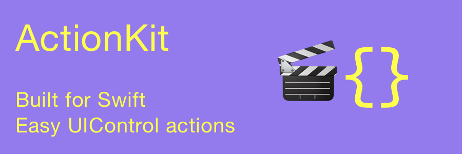

[](http://cocoadocs.org/docsets/ActionKit)
[](https://github.com/Carthage/Carthage)
[](http://cocoadocs.org/docsets/ActionKit)
[](http://cocoadocs.org/docsets/ActionKit)


# ActionKit

ActionKit is a light-weight, easy to use framework that wraps the target-action design paradigm into a less verbose, cleaner format. It shortens target-action method calls by removing the target and replacing the selector with a closure.

### Example of target-action *without* ActionKit
```swift
button.addTarget(self, action: #selector(MyViewController.buttonWasTapped(_:)), forControlEvents: .TouchUpInside)
```

#### and somewhere else...
```
func buttonWasTapped(sender: Any) {
  if let button = sender as? UIButton {
    button.setTitle("Button was tapped!", forState: .Normal)
  } 
}
```

### Or *with* ActionKit, all in one place
```swift
button.addControlEvent(.touchUpInside) { (control: UIControl) in
  guard let button = control as? UIButton else {
    return
  }
  button.setTitle("Button was tapped!", forState: .Normal)

}
```

## Installation

### CocoaPods
 ActionKit is available through [CocoaPods](http://cocoapods.org). To install
 it, simply add the following line to your Podfile:
 
    pod 'ActionKit', '~> 2.5.2'

### Carthage

- 1. Add the following to your *Cartfile*:

```
    github "ActionKit/ActionKit" == 2.5.2
``` 
   
- 2. Run `carthage update`
- 3. Add the framework as described in [Carthage Readme](https://github.com/Carthage/Carthage#adding-frameworks-to-an-application)

## How it works

ActionKit extends target-action functionality by providing easy to use methods that take closures instead of a selector. ActionKit uses a singleton which stores the closures and acts as the target. Closures capture and store references to any constants and variables from their context, so the user is free to use variables from the context in which the closure was defined in.

## Features

* Add an action based closure to any `UIGestureRecognizer` subclass (eg. `UITapGestureRecognizer`, `UIPanGestureRecognizer`...) instead of needing to use the target-action mechanism
* Remove actions added to `UIGestureRecognizer` subclasses
* Add an action based closure to any `UIControl` subclass (eg: `UIButton`, `UIView`, `UISwitch`...) instead of needing to use the target-action mechanism
* For `UIControl`s, add an action for any number of `controlEvent`s
* Remove actions added to `UIControl` subclasses
* Add an action based closure to any `UIBarButtonItem`, instead of needing target-action
* Remove actions added to `UIBarButtonItem`s

## Examples

See the [examples wiki](EXAMPLES.md)

## Changelog

See the [changelog here](CHANGELOG.md)

## License

Licensed under the terms of the MIT license. See [LICENSE](LICENSE) file
